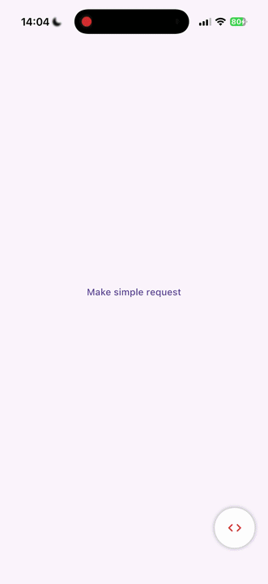

# Chili Debug view

<a href="https://chililabs.io/"></a>


Chili DebugView — an open-source Flutter package designed by Chili Labs to make life easier for QA engineers and project managers. With DebugView, you can collect, view, and monitor network logs directly in your Flutter app, streamlining your testing and debugging workflow.

Read more: [Making Debugging and Testing Process Easier with Chili Flutter DebugView](https://chililabs.io/blog/making-debugging-and-testing-process-easier-with-chili-flutter-debugview)

# Get started

Package uses dio (https://pub.dev/packages/dio) starting from version 5.9.0 to provide network logs,
so in order to use this package your requests must go through dio.

For sharing it uses share_plus (https://pub.dev/packages/share_plus)
and path_provider (https://pub.dev/packages/path_provider) 

## Install 

Add `chili_debug_view` to your `pubspec.yaml`:

```
dependencies:
  chili_debug_view: ^1.3.0
```

## Usage

1. Wrap your app via DebugView providing navigation key

```
import 'package:chili_debug_view/chili_debug_view.dart';

...
class _AppState extends State<App> {
  final rootKey = GlobalKey<NavigatorState>();

  @override
  Widget build(BuildContext context) {
    return MaterialApp(
      navigatorKey: rootKey,
      builder: (_, app) {
        return DebugView(
          navigatorKey: rootKey,
          showDebugViewButton: true,
          app: app,
          onProxySaved: (proxyUrl) { },
        );
      },
      ...
    );
  }
...
```

2. To see network logs you need to add interceptor to your dio

```
import 'package:chili_debug_view/chili_debug_view.dart';

dio.interceptors.add(NetworkLoggerInterceptor());
```

# Sample Project

There is an [example app](https://github.com/ChiliLabs/chili_debug_view/tree/main/example) with simple request and app wrapping.


